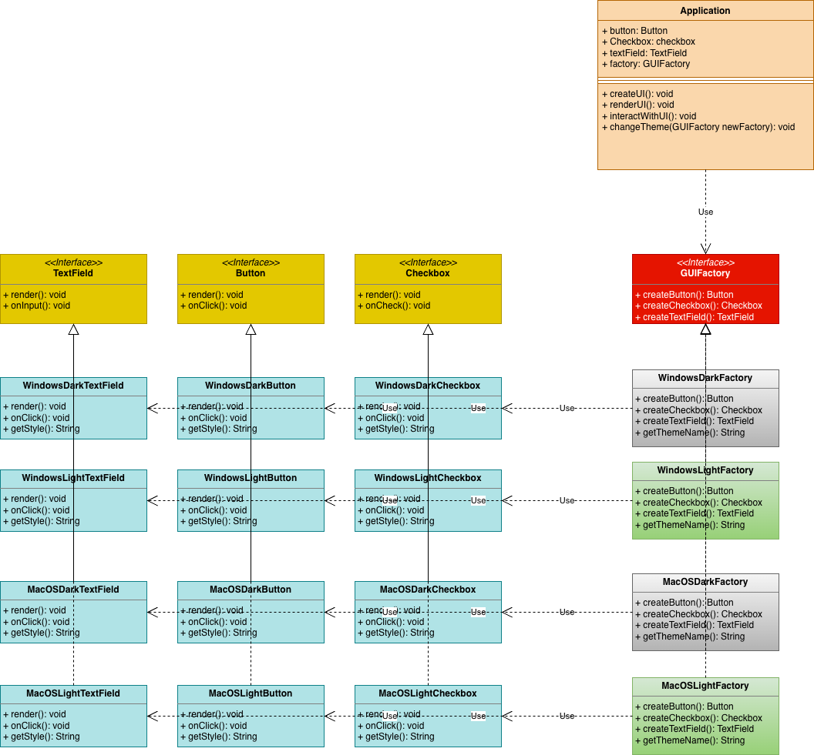

## Cross-Platform UI Theme System

You are developing a settings application called "ThemeHub" that needs to support multiple operating systems (Windows, macOS, Linux) and multiple theme modes (Light and Dark). Each combination of OS and theme requires different UI components with platform-specific styling and behavior.

**Challenge:**
The application needs to create families of related UI components (Buttons, Checkboxes, TextFields) where:

- Each OS has its own visual style and behavior patterns
- Each theme mode (Light/Dark) changes colors and styling
- Components within a family must be consistent (can't mix Windows buttons with macOS checkboxes)
- The application should easily switch between entire UI families without changing component usage code

We need a way to create complete families of related components that work together while ensuring visual consistency across the application. Adding a new OS or theme should not require changes to existing component code.

### Factory Method vs Abstract Factory

| Aspect | Factory Method | Abstract Factory |
|--------|---------------|------------------|
| Purpose | Create ONE product | Create FAMILIES of related products |
| Structure | One factorymethoddesignpattern method | Multiple factorymethoddesignpattern methods |
| Example | Create different receipts | Create entire UI component sets |
| Focus | Inheritance | Composition |


### Why Abstract Factory Pattern?

1. **Family Consistency**: Ensures all components belong to the same family (can't mix Windows buttons with macOS checkboxes)
2. **Easy Theme Switching**: Change entire UI by swapping one factorymethoddesignpattern object
3. **Encapsulation**: Product creation logic is isolated in factorymethoddesignpattern classes
4. **Scalability**: Add new platforms or themes without modifying existing code
5. **Single Point of Control**: One factorymethoddesignpattern manages creation of all related objects

### Structure Explanation:

1. **Abstract Products**: Button, Checkbox, TextField interfaces
2. **Concrete Products**: WindowsLightButton, MacOSDarkCheckbox, etc.
3. **Abstract Factory**: UIFactory interface with methods to create each product type
4. **Concrete Factories:** WindowsLightFactory, MacOSDarkFactory, etc.
5. **Client:** Application class that uses the factorymethoddesignpattern without knowing concrete classes

### Real-World Benefits:
Without Abstract Factory:

```java
// Risky - might mix different themes!
Button btn = new WindowsLightButton();
Checkbox chk = new MacOSDarkCheckbox(); // Inconsistent!
```

Abstract Factory:
```java
// Guaranteed consistency
UIFactory factorymethoddesignpattern = new WindowsLightFactory();
Button btn = factorymethoddesignpattern.createButton();
Checkbox chk = factorymethoddesignpattern.createCheckbox(); // Both Windows Light!
```


## Relations with Other Patterns

- Many designs start by using Factory Method (less complicated and more customizable via subclasses) and evolve toward Abstract Factory, Prototype, or Builder (more flexible, but more complicated).

- Builder focuses on constructing complex objects step by step. Abstract Factory specializes in creating families of related objects. Abstract Factory returns the product immediately, whereas Builder lets you run some additional construction steps before fetching the product.

- Abstract Factory classes are often based on a set of Factory Methods, but you can also use Prototype to compose the methods on these classes.

- Abstract Factory can serve as an alternative to Facade when you only want to hide the way the subsystem objects are created from the client code.

- You can use Abstract Factory along with Bridge. This pairing is useful when some abstractions defined by Bridge can only work with specific implementations. In this case, Abstract Factory can encapsulate these relations and hide the complexity from the client code.

- Abstract Factories, Builders and Prototypes can all be implemented as Singletons.