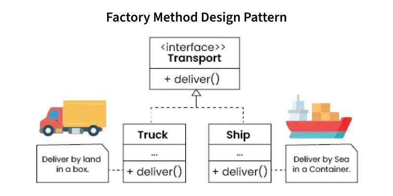

# Factory method Design Pattern

The Factory Method is a creational design pattern that defines an interface for creating objects but lets subclasses decide which object to instantiate. It promotes loose coupling by delegating object creation to a method, making the system more flexible and extensible.

- Subclasses override the factorymethoddesignpattern method to produce specific object types.
- Supports easy addition of new product types without modifying existing code.
- Enhances maintainability and adaptability at runtime.

### Real World Use Cases
- **Web Browsers (e.g., Chrome, Firefox)**
Browsers use factorymethoddesignpattern methods to create different types of plugins or page renderers based on content type (e.g., PDF, HTML, Flash). This allows flexible and extensible handling of various media.
- **Android OS (Activity Instantiation)**
In Android, activities are often created using factorymethoddesignpattern methods internally to manage lifecycle and resource setup. Developers override methods like onCreate() while the system handles object creation.
- **Payment Gateways (e.g., Stripe, PayPal)**
E-commerce platforms use factorymethoddesignpattern methods to create different payment processors. Based on user selection, the factorymethoddesignpattern returns an instance of the correct payment service without changing client logic.
- **Game Development (e.g., Unity, Unreal Engine)**
Games use factorymethoddesignpattern methods to spawn enemies, items, or NPCs dynamically based on game level or environment. This decouples object creation from the game logic and enables easy scalability.

### Features of Factory Method Design Pattern
- **Encapsulation of Object Creation**: Clients don’t know how objects are created.
- **Loose Coupling**: Reduces dependency between client and concrete classes.
- **Scalability**: New product types can be introduced without altering client code.
- **Reusability**: Common creation logic can be reused across factories.
- **Flexibility**: Supports multiple product families with minimal changes.
- **Testability**: Easy to use mock factories for unit testing

### When to Use the Factory Method
- When object creation logic is complex or varies based on conditions.
- When the system needs to be open for extension but closed for modification (OCP).
- When new product types may be added in the future.
- When you want to decouple client code from concrete implementations.

### Real World Software Examples
- Used in JDBC for creating connections and in frameworks like Spring for managing beans.
- Libraries like Swing and JavaFX use factories to create flexible UI components.
- Tools like Log4j rely on factories to create configurable loggers.
- Factories help create objects from serialized data, supporting various formats.
- An E-Commerce Platform may create a ProductFactory to create different types of products at runtime. 
- A Notification System may use it to create different types of notifications like WhatsApp, SMS, etc.

### [← Previous: Factory Design Pattern](./FactoryMethodDesignPattern.md) | [Home](./Index.md) | [Next: Issues And Solutions →](./IssuesAndSolutions.md)

