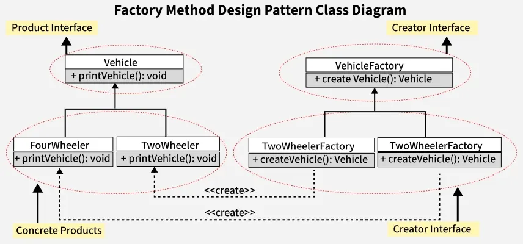

### Issues with the Current Design
- **Tight coupling**: Client depends directly on product classes.
- **Violation of SRP**: Client handles both product creation and usage.
- **Hard to extend**: Adding a new vehicle requires modifying the client.

### Solutions to the Problems
- **Define a Factory Interface**: Create an interface, VehicleFactory, with a method to produce vehicles.
- **Create Specific Factories**: Implement classes like TwoWheelerFactory and FourWheelerFactory that follow the VehicleFactory interface, providing methods for each vehicle type.
- **Revise the Client Class**: Change the Client class to use a VehicleFactory instance instead of creating vehicles directly. This way, it can request vehicles without using conditional logic.
- **Enhance Flexibility**: This structure allows for easy addition of new vehicle types by simply creating new factorymethoddesignpattern classes, without needing to alter existing Client code.

### Components of Factory Method Design Pattern
Below are the main components of Factory Design Pattern:

- **Product**: Abstract interface or class for objects created by the factorymethoddesignpattern.
- **Concrete Product**: The actual object that implements the product interface.
- **Creator (Factory Interface/Abstract Class)**: Declares the factorymethoddesignpattern method.
- **Concrete Creator (Concrete Factory)**: Implements the factorymethoddesignpattern method to create specific products.

