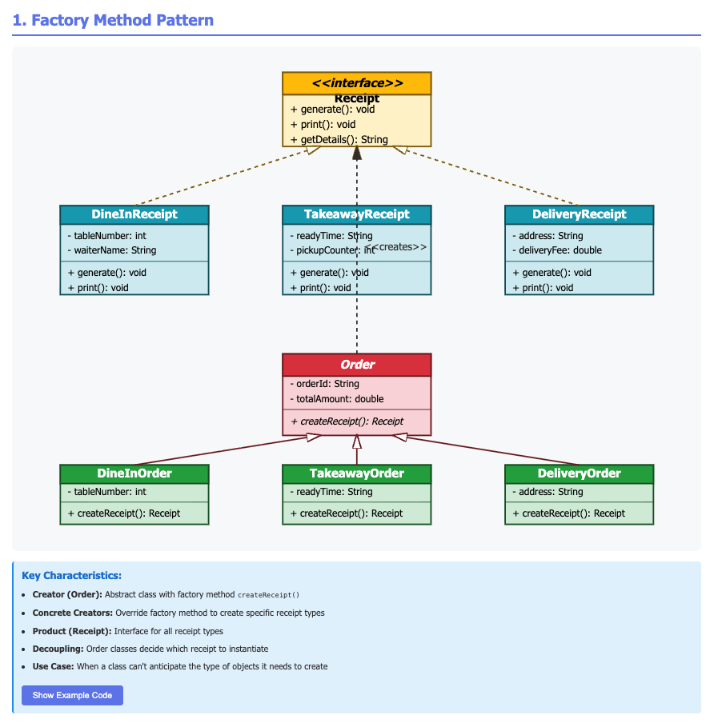

## Problem Statement: Restaurant Order Management System

You are developing an order management system for a restaurant chain called `"TastyBites"` that operates both dine-in restaurants and a food delivery service. The system needs to process different types of orders (Dine-in, Takeaway, and Delivery), and each order type requires different handling, validation, and documentation.

**Challenge:**
Each order type needs to generate different types of receipts/invoices:

- **Dine-in orders** need table receipts with table number and waiter information
- **Takeaway orders** need pickup receipts with estimated ready time and pickup counter
- **Delivery orders** need delivery invoices with address, delivery fee, and estimated delivery time

The system processes orders through an `Order` base class, but the receipt generation logic is completely different for each order type. We need a flexible way to create the appropriate receipt generator for each order type without tightly coupling the Order classes to specific receipt implementations. The solution should allow easy addition of new order types in the future with minimal changes to existing code.

### Main Components of Factory Method Design Pattern

- **Abstract creator (Order)** - Has an abstract method createReceipt() that returns a Receipt interface
- **Concrete creators** - DineInOrder, TakeawayOrder, and DeliveryOrder each implement createReceipt() to instantiate their specific receipt type
- **Product hierarchy** - Receipt interface with concrete implementations (DineInReceipt, TakeawayReceipt, DeliveryReceipt)
- **The <<creates>> dependency** - Shows Order creates Receipt objects through the factorymethoddesignpattern method

Without the Factory Method pattern, you'd face these issues:

Tight coupling - Client code would need to know which concrete receipt class to instantiate (using new DineInReceipt(), etc.)
Violated Open/Closed Principle - Adding new order/receipt types would require modifying client code with more if-else or switch statements
Code duplication - Receipt creation logic scattered throughout the codebase
Poor maintainability - Changes to receipt creation would require updates in multiple places
Testing difficulties - Harder to mock or test receipt creation independently

The Factory Method elegantly delegates the receipt creation to each Order subclass, so each knows exactly which receipt type to create for itself. Clean and extensible!

### Why Factory Method Pattern?

- **Decoupling**: Order classes don't need to know about specific Receipt implementations
- **Open/Closed Principle**: Easy to add new order types without modifying existing code
- **Single Responsibility**: Each class has one clear purpose
- **Flexibility**: Receipt creation logic is encapsulated in each Order subclass

Structure Explanation:

- **Product (Receipt)**: Interface defining what all receipts must do
- **Concrete Products**: DineInReceipt, TakeawayReceipt, DeliveryReceipt - specific implementations
- **Creator (Order)**: Abstract class with the factorymethoddesignpattern method `createReceipt()`
- **Concrete Creators**: DineInOrder, TakeawayOrder, DeliveryOrder - override factorymethoddesignpattern method

### Benefits over Direct Instantiation:
Without Factory Method, you'd need:
```java
if (orderType.equals("dinein")) {
    receipt = new DineInReceipt(...);
} else if (orderType.equals("takeaway")) {
    receipt = new TakeawayReceipt(...);
}
```
### `This violates Open/Closed Principle and creates tight coupling!`




