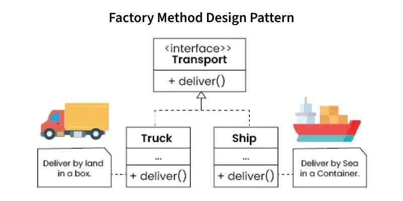

# Factory method Design Pattern

The Factory Method is a creational design pattern that defines an interface for creating objects but lets subclasses decide which object to instantiate. It promotes loose coupling by delegating object creation to a method, making the system more flexible and extensible.

- Subclasses override the factory method to produce specific object types.
- Supports easy addition of new product types without modifying existing code.
- Enhances maintainability and adaptability at runtime.

### [← Previous: Home](./Index.md) |[Next: Real World Use Cases →](./real_wold_use_cases.md)

